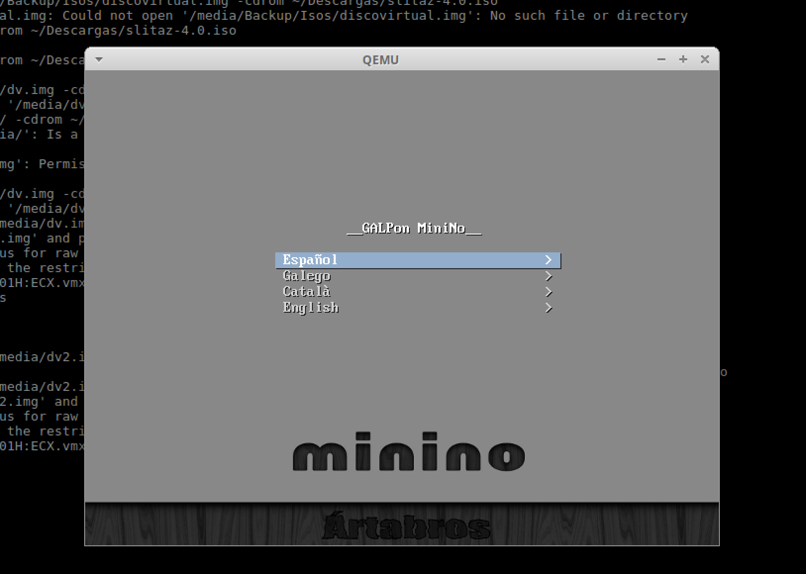

# Ejercicios Tema 5
## Francisco José Fernández Muelas


#### 1: Instalar los paquetes necesarios para usar KVM. Se pueden seguir estas instrucciones. Ya lo hicimos en el primer tema, pero volver a comprobar si nuestro sistema está preparado para ejecutarlo o hay que conformarse con la paravirtualización.

En mi sistema (máquina virtual en VirtualBox de Ubuntu 16 sobre MacOS) parece ser que me tengo que conformar con la paravirtualización, ya que el comando

```bash
egrep '^flags.*(vmx|svm)' /proc/cpuinfo
```
no me muestra nada.
Para instalar los paquetes, sigo las instrucciones del enlace:

```bash
sudo apt-get install qemu-kvm libvirt-bin
adduser paco kvm
adduser paco libvirt

```
Aún así, al ejecutar

```bash
virsh --connect qemu:///system list --all
```

me daba un problema de permisos, que he solucionado reiniciando KVM con:

```bash
rmmod kvm
modprobe -a kvm
```


#### 2: Crear varias máquinas virtuales con algún sistema operativo libre tal como Linux o BSD. Si se quieren distribuciones que ocupen poco espacio con el objetivo principalmente de hacer pruebas se puede usar CoreOS (que sirve como soporte para Docker) GALPon Minino, hecha en Galicia para el mundo, Damn Small Linux, SliTaz (que cabe en 35 megas) y ttylinux (basado en línea de órdenes solo).

Máquina virtual con Slitaz:

```bash
sudo qemu-img create -f qcow2 /media/sli.qcow 500M
sudo qemu-system-x86_64 -hda /media/sli.qcow -cdrom	~/Descargas/slitaz-4.0.iso
```


Máquina virtual con GALPon Minino:

```bash
sudo qemu-img create -f qcow2 /media/gal.qcow 1G
sudo qemu-system-x86_64 -hda /media/gal.qcow -cdrom	~/Descargas/minino-artabros-2.1_minimal.iso
```




#### 4: Crear una máquina virtual Linux con 512 megas de RAM y entorno gráfico LXDE a la que se pueda acceder mediante VNC y ssh.

Voy a instalar Lubuntu, la versión de Ubuntu con LXDE.

```bash
sudo qemu-img create -f qcow2 ~/Documentos/lub.img 3G

sudo qemu-system-x86_64 -hda ~/Descargas/lub.img -cdrom ~/Descargas/lubuntu-16.10-desktop-i386.iso -m 512
```
Cuando empezaba la instalación, se cerraba el proceso automaticamente debido a un error que no he podido arreglar, probablemente por el tema de que el procesador no soporte la 'hardware virtualization'.

#### 5: Crear una máquina virtual ubuntu e instalar en ella alguno de los servicios que estamos usando en el proyecto de la asignatura.

Primero, instalo la CLI de azure:

```bash
sudo npm install -g azure-cli
```
Inicio sesión con mi cuenta:

```bash
azure login
```


Paso al modo clásico de comandos:

```bash
 azure config mode asm
 ```

Para listar las imágenes disponibles:

```bash
azure vm image list | grep "Linux"
```

Ahora ya paso a crear la VM (la opción -e es para permitir conexiones ssh):

```bash
azure vm create ubuntu-IV-paquillo b39f27a8b8c64d52b05eac6a62ebad85__Ubuntu_DAILY_BUILD-xenial-16_04-LTS-amd64-server-20170119.1-en-us-30GB -g ops -p P@ssw0rd! -z "Small" -e -l "West Europe"
```
Para ver infomarción sobre la máquina:

```bash
azure vm show ubuntu-IV-paquillo
```

Una vez creada, paso a iniciarla y conectarme por ssh:

```bash
azure vm start ubuntu-IV-paquillo
ssh ubuntu-IV-paquillo.cloudapp.net
```

Dentro la máquina, ya podemos instalar por ejemplo Node.js:

```bash
sudo apt-get update && sudo apt-get install nodejs
```
