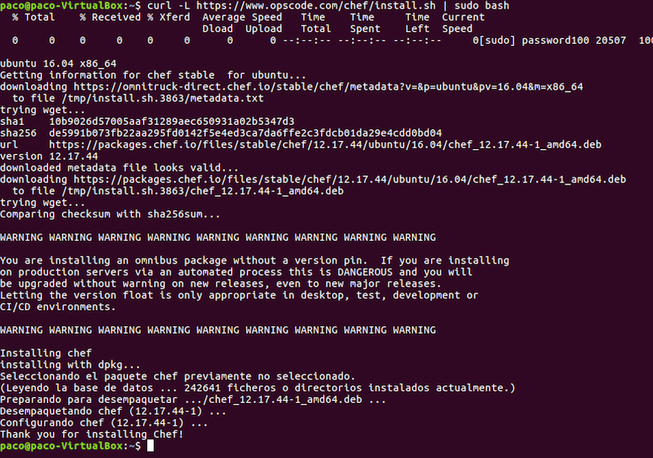
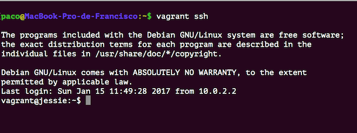
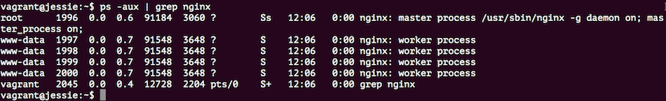
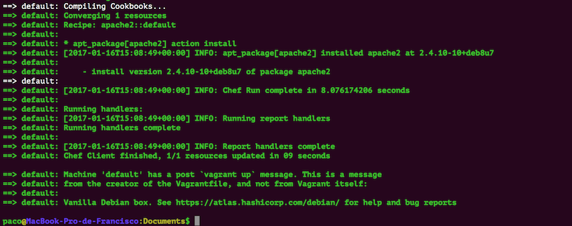

#Ejercicios Tema 6
## Francisco José Fernández Muelas


#### 1: Instalar chef en la máquina virtual que vayamos a usar



#### 2: Crear una receta para instalar la aplicación que se viene creando en la asignatura en alguna máquina virtual o servidor en la nube.

Voy a crear una receta para la aplicaciónd e calificación de empresas. La receta es:

```js
git '/home/paco/empresas' do
  repository 'https://github.com/fjfernandez93/empresas.git'
  reference "master"    
  action :sync
  user "paco"
end

package 'nodejs-legacy'

execute "npm-install" do
cwd "home/paco/empresas"
command "npm install"
user "paco"
group "sudo"
action :run
end
```

El primer comando clona el repositorio del proyecto en el servidor, el segundo installa el paquete "nodejs-legacy" (que incluye 'npm'), y el último instala la aplicación (para las dependencias).

EL archivo node.json con el recetario contiene:

```json
{
"run_list": [ "recipe[empresas]" ]
}
```

El archivo solo.rb contiene las rutas correspondientes:
```rb
file_cache_path "/home/paco"
cookbook_path "/home/paco/chef/cookbooks"
json_attribs "/home/paco/node.json"
```

Para ejecutar la instalación, desde el directorio donde se encuentra 'solo.rb':

```bash
sudo chef-solo -c chef/solo.rb
```

#### 4: Instalar una máquina virtual Debian usando Vagrant y conectar con ella.


Por problemas con la máquina virtual de Ubuntu, he hecho este ejercicio y los siguientes con Vagrant instalado directamente en MacOS.

```bash
brew install vagrant
```

```bash
vagrant init debian/jessie64
```

```bash
vagrant up --provider virtualbox
```
Con este comando vagrant se encarga de descargar la imagen de Debian y de iniciarla
(el parámetro --provider lo pongo por la indicación que se da [aquí](https://atlas.hashicorp.com/debian/boxes/jessie64)).

Cuando acaba de iniciarse, ya podemos acceder a ella por ssh mediante:

```bash
vagrant ssh
```


#### 5: Crear un script para provisionar `nginx` o cualquier otro servidor web que pueda ser útil para alguna otra práctica.

Tengo que añadir al Vagrantfile la siguiente línea:

```rb
config.vm.provision "shell",
		inline: "sudo apt-get update && sudo apt-get install -y nginx && sudo service nginx start"
```

Con ella indico que se ejecuten en un shell los 3 comandos: actualizar repositorios, instalar nginx (con el parámetro -y para que diga "yes" a todo) e iniciar el servicio. Para que se ejecute sin tener que reiniciar la máquina, ejecuto en el anfitrión:

```bash
vagrant provision
```

Que inmediatamente empiza a ejecutar los comandos y mostrar la salida. Para comprobar que se ha iniciado correctamente, en la máquina virtual ejecuto:

```bash
ps -aux | grep nginx
```



#### 6: Configurar tu máquina virtual usando vagrant con el provisionador chef.

Lo primero es crear la receta para que instale (por ejemplo) el servidor web Apache). Tiene que ponerse en una estructura de directorios como esta:

```bash
|-- cookbooks
|   |-- apache2
|       |-- recipes
|           |-- default.rb
```
El archivo default.rb contendrá:

```rb
package 'apache2'
```
Y añadir al Vagrantfile esto:
```rb
config.vm.provision "chef_solo" do |chef|
    chef.cookbooks_path = "/Users/paco/Documents/debi/cookbooks"
 		chef.add_recipe "apache2"
  end
```
La carpeta que contenga este árbol de directorios debe especificarse en Vagrantfile.
La sincronización de la carpeta me ha dado algunos errores que he encontrado [aquí](https://github.com/mitchellh/vagrant/issues/6769) que el problema era por la falta de unos puglins, que he instalado así:

```bash
vagrant plugin install vagrant-vbguest
vagrant destroy && vagrant up
```
Una vez que termina con éxito:



tenemos disponible la máquina con Apache. Para provisionarla con cualquier otra cosa, con añadir al directorio 'cookbooks' las recetas correspondientes (como por ejemplo la usada en el ejercicio 2) tendríamos la máquina lista.
